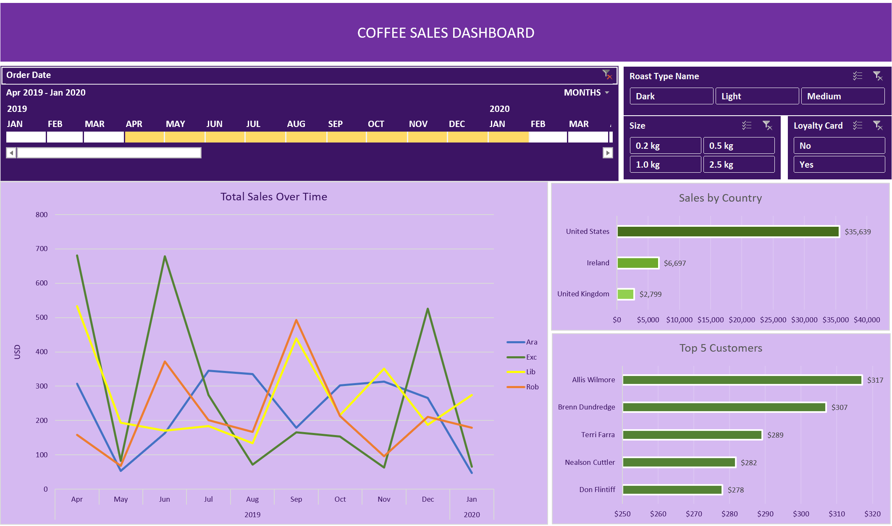

# ☕ Coffee Sales Dashboard — Excel Portfolio Project

An interactive Excel dashboard analysing coffee sales across multiple dimensions — built to demonstrate real-world data analysis skills including data transformation, dynamic charting, and business intelligence reporting.

---

## 📊 Dashboard Preview



---

## 🎯 Project Overview

This project transforms a raw coffee sales dataset into a fully interactive business dashboard. The goal was to answer key business questions a sales manager or finance team would actually care about — not just display data, but tell a story with it.

**Business questions this dashboard answers:**
- How are total sales trending over time?
- Which roast type and coffee size drives the most revenue?
- Which countries are our strongest markets?
- Who are our top 5 customers by spend?

---

## 🛠️ Tools & Techniques Used

| Skill | Application |
|---|---|
| `XLOOKUP` | Pulled customer, product, and country data across multiple sheets |
| `INDEX / MATCH` | Dynamic lookups for roast type and size mapping |
| Pivot Tables | Aggregated sales by time period, country, and customer |
| Pivot Charts | Visual representation of trends and comparisons |
| Slicers | Interactive filters for roast type, coffee size, and country |
| Timeline Filter | Time-based drill-down across the full sales period |
| Named Ranges | Clean, maintainable formula references throughout |
| Data Formatting | Custom number formats, date formatting, consistent styling |

---

## 📁 File Structure
```
coffee-sales-dashboard/
│
├── coffee_sales_dashboard.xlsx   ← Main workbook (open this)
├── dashboard-screenshot.png      ← Dashboard preview image
└── README.md                     ← This file
```

---

## 🔍 Key Features

**Dynamic Filters** — Four slicers let you slice the data instantly by:
- Roast type (Dark, Light, Medium)
- Package size (0.2 kg, 0.5 kg, 1 kg, 2.5 kg)
- Country (United States, Ireland, United Kingdom)
- Time period (monthly / quarterly via timeline)

**Sales Over Time Chart** — Line chart tracking revenue trends across the full dataset period, updating dynamically with every filter selection.

**Top 5 Customers Panel** — Bar chart identifying the highest-value customers, useful for retention and loyalty strategy.

**Country Comparison** — Horizontal bar chart comparing total sales across markets at a glance.

---

## 💡 What I Learned

- How to structure a multi-sheet workbook so raw data, calculations, and the dashboard are cleanly separated
- Using `XLOOKUP` as a modern, more flexible replacement for `VLOOKUP`
- Building pivot tables that refresh dynamically when source data changes
- Designing a dashboard layout where every visual element earns its place — no chart clutter
- The importance of consistent formatting for a professional, readable output

---

## 🔗 Part of My Learning Roadmap

This is **Project 1** in my Excel & Data Analytics portfolio, built as part of a structured self-learning path toward a career in accounting analytics and FP&A.

**Full roadmap:** Excel → Power Query → Power BI → SQL → CPA (Alberta)

| Project | Tool | Status |
|---|---|---|
| Coffee Sales Dashboard | Excel | ✅ Complete |
| Data Cleaning + Financial Dashboard | Excel + Power Query | 🔄 Up next |
| Manitoulin Financial Dashboard | Power BI | ⬜ Planned |
| Accounting Database Queries | SQL | ⬜ Planned |

---

## 👤 About Me

Accounting Coordinator with hands-on experience in full-cycle AR/AP, payroll, tax compliance, and multi-entity financial reporting. Building toward a CPA designation and a career in data-driven accounting and FP&A.

📍 Ontario, Canada → Calgary (planned)
🔗 [LinkedIn](https://www.linkedin.com/in/dipesh07)

---

*Built following the Mo Chen Excel Portfolio Project tutorial — dataset sourced from the tutorial.*
